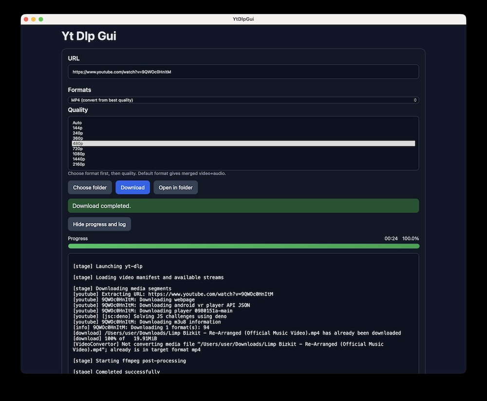

# yt-dlp-gui

[](LICENSE)
[](https://github.com/michaelalexeevweb/yt-dlp-gui/actions/workflows/ci.yml)
[](https://github.com/michaelalexeevweb/yt-dlp-gui/releases)
[](https://packagist.org/packages/michaelalexeevweb/yt-dlp-gui)

Packagist: [michaelalexeevweb/yt-dlp-gui](https://packagist.org/packages/michaelalexeevweb/yt-dlp-gui)

Install via Composer:

```bash
composer require michaelalexeevweb/yt-dlp-gui
```

Simple macOS desktop GUI for `yt-dlp` built with PHP and Boson.

Download videos from YouTube and other sites using a simple desktop interface.

Currently supports macOS only.

## Screenshot



## Requirements

- PHP 8.4+
- `ext-ffi`
- [Boson compiler](https://github.com/boson-php/boson)
- `yt-dlp`, `ffmpeg`, `ffprobe` (bundled in portable release)

## Releases

Two builds are available:

- [`YtDlpGui-macos-arm64-desktop.zip`](https://github.com/michaelalexeevweb/yt-dlp-gui/releases/download/1.0.0/YtDlpGui-macos-arm64-desktop.zip) - Desktop build, requires user-installed tools
- [`YtDlpGui-macos-arm64-portable.zip`](https://github.com/michaelalexeevweb/yt-dlp-gui/releases/download/1.0.0/YtDlpGui-macos-arm64-portable.zip) - Portable build, includes `yt-dlp`, `ffmpeg`, `ffprobe`

## Quick start

Download the portable release and run the app.

Build commands (Docker-first):

`release-macos-*` targets run inside `docker compose` by default.

```bash
make release-macos-portable
make release-macos-desktop
```

Outputs to `dist/release/`.

## Work locally (Docker)

Build container image:

```bash
docker compose build php
```

Install dependencies:

```bash
docker compose run --rm php composer install
```

Run checks:

```bash
docker compose run --rm php composer check
```
